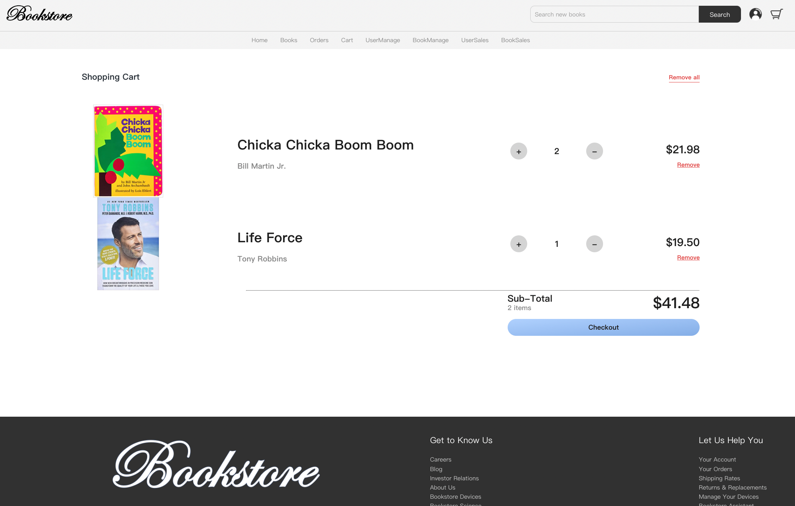
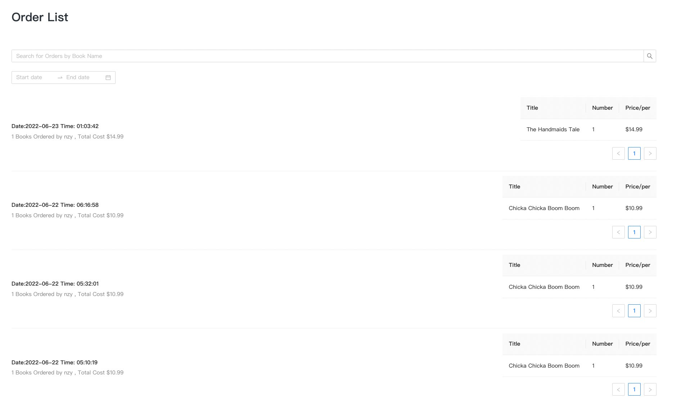
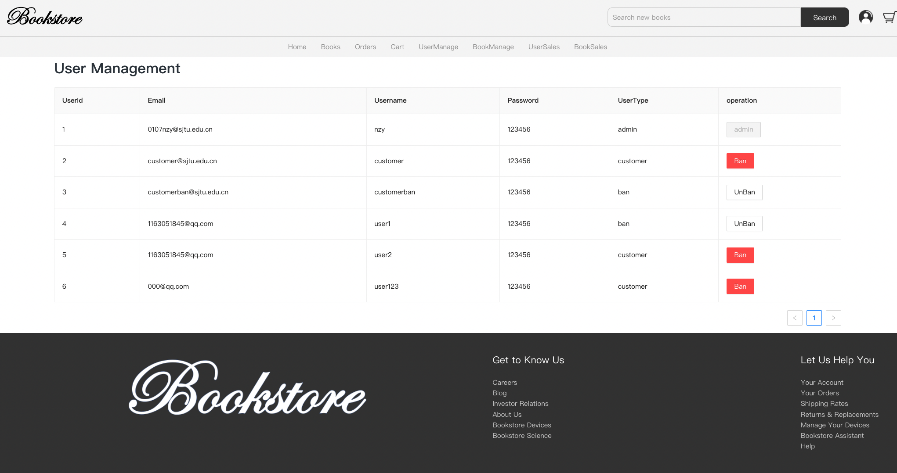
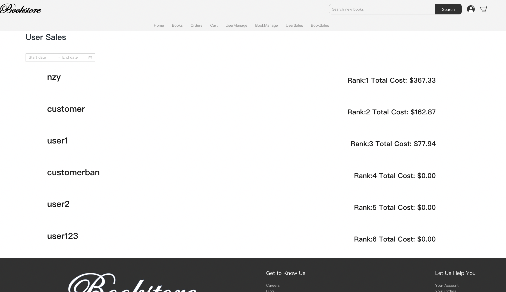

# E-Bookstore by React & Spring
## Technology Stack
* Frontend:
  * React
  * AntDesign
* Backend
  * Spring Boot
  * Hibernet
* Database
  * MySQL
* Network
  * Fetch api
## Customer Functions
* Login 
* Register 
* Logout 
* Home 
* Search Book 
* Book Detail 
* Cart 
* Check out 
* Order record 
## Admin Functions
* User manage(ban/unban) 
* Book manage(add/delete/edit) 
* User sales rank 
* Book sales rank 

